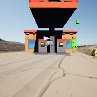

# Project Name  MDEV1003f23

## Description

A github repository for the in class demonstration code.   
 
## Usage
Clone, or download the zip, to a local directory. Open in Unreal Engine 5.2 or newer

## Attributions
1. Audio, No More Magic, HorrorPen, OpenGameART, ( https://opengameart.org/content/no-more-magic )
2. Audio, Battle Theme, cynicmusic, OpenGameArt, ( https://opengameart.org/content/battle-theme-a )
3. Audio, Tin Can , pixabay CC), ( https://pixabay.com/sound-effects/search/tin-can/  ) 
4. Image, Grey ashphalt - Kevin - Pexels ( https://www.pexels.com/photo/gray-asphalt-road-5177297/ )
5. Worn Brick Wall material, Freepbr.org, ( https://freepbr.com/materials/worn-out-old-brick-wall-pbr-material/ )
6. 

